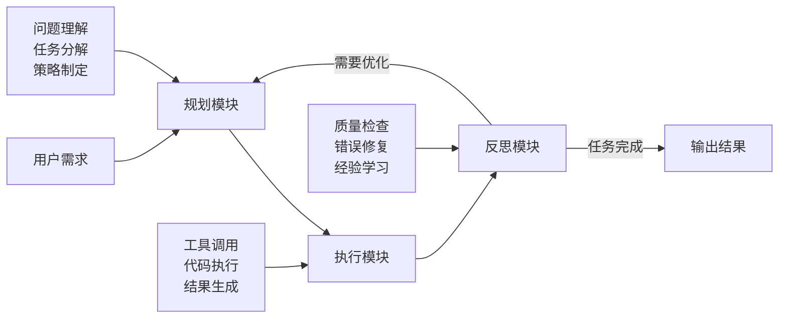
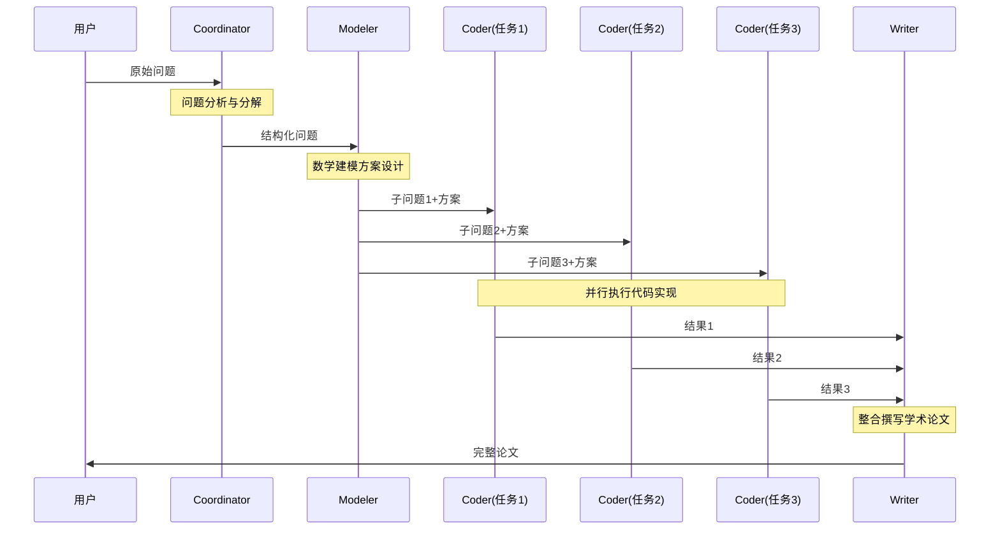
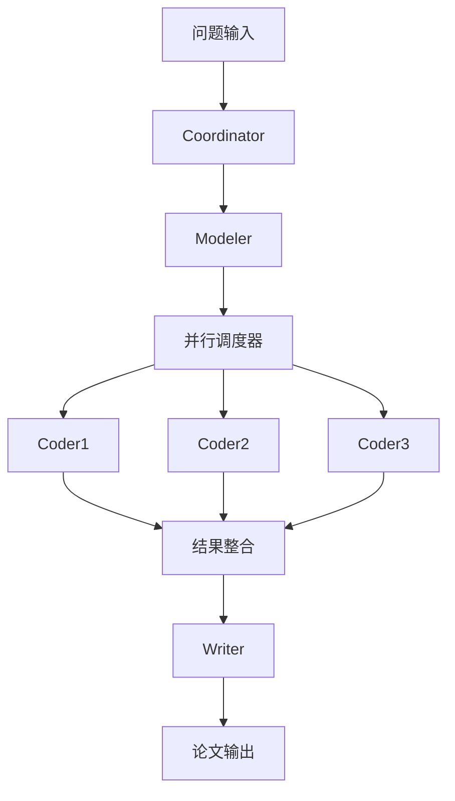
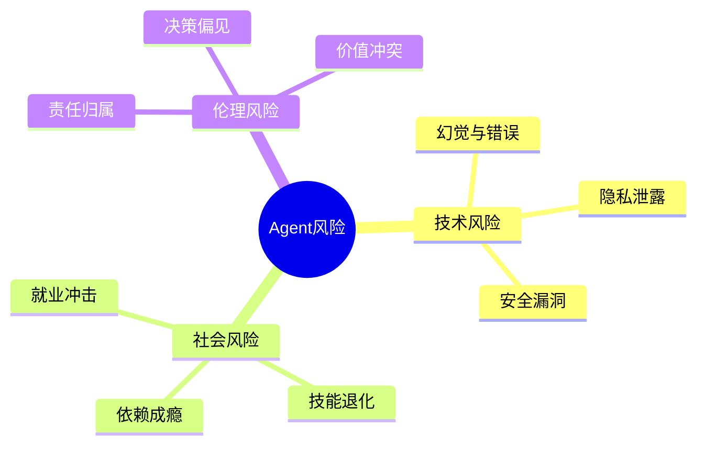
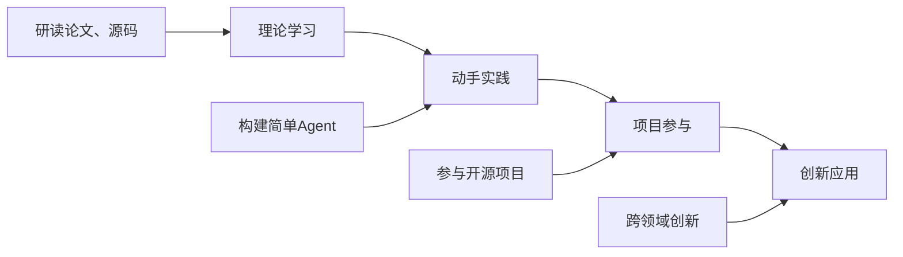

# 从代码到智能：Agent协作原理解析

## 以MathModelAgent为例深入理解智能体系统

---

# 课程大纲

## 第一部分：什么是Agent？
- Agent vs 传统程序
- "智能"的来源分析
- 核心能力解析

## 第二部分：Agent内部机制  
- 思考过程：Prompt Engineering
- 行动机制：工具调用
- 学习机制：记忆管理

## 第三部分：多Agent协作
- 为什么需要协作？
- 通信与数据传递
- 协作模式分析

## 第四部分：实战工作流
- 完整任务追踪
- 并发执行优化
- 实时状态监控

## 第五部分：技术实现
- 系统架构设计
- 异步任务调度
- 关键代码分析

## 第六部分：未来展望
- 技术发展趋势
- 挑战与机遇
- 学习建议

---

# 第一部分：什么是Agent？

---

## 核心问题

### 为什么一堆代码会有"自主意识"？

#### 传统程序 vs Agent系统

**传统程序的局限性**
- 固定的if-else逻辑
- 无法处理未知情况
- 需要精确的输入格式
- 缺乏自适应能力

**Agent的突破**
- 动态推理决策
- 处理模糊需求
- 自主错误修正
- 具备学习能力

---

## 代码对比：传统vs智能

### 传统程序示例

```python
def solve_math_problem(problem):
    if problem_type == "optimization":
        return optimization_algorithm()
    elif problem_type == "statistics": 
        return statistical_analysis()
    # 问题：无法处理新类型的问题
```

### Agent系统示例

```python
class Agent:
    async def run(self, problem):
        # 1. 理解问题 (LLM推理)
        understanding = await self.llm.analyze(problem)
        # 2. 制定计划 (动态规划) 
        plan = await self.llm.plan(understanding)
        # 3. 执行行动 (工具调用)
        result = await self.execute_tools(plan)
        # 4. 反思优化 (自我修正)
        return await self.reflect_and_improve(result)
```

**关键差异：Agent具备动态推理和自适应能力**

---

## Agent的"智能"来源

### 三大核心组件

#### 1. 大语言模型推理引擎

```python
class Agent:
    def __init__(self, model: LLM):
        self.model = model  # GPT-4, Claude等
        self.memory = []    # 记忆系统  
        self.tools = []     # 工具集合
```

#### 2. Agent三大核心模块

### 🧠 规划模块：理解问题 + 制定策略

**功能**：将用户的自然语言需求转化为可执行的行动计划

**MathModelAgent实例**：
```python
# 用户输入："我需要优化物流配送路径"
# Coordinator Agent的规划过程：

async def plan_solution(self, user_input):
    # 第1步：理解问题本质
    understanding = await self.analyze_problem(user_input)
    # 结果：识别为"车辆路径优化问题(VRP)"
    
    # 第2步：分解任务
    subtasks = {
        "ques1": "如何建立数学优化模型？",
        "ques2": "如何设计求解算法？", 
        "ques3": "如何评估优化效果？"
    }
    
    # 第3步：制定执行策略
    strategy = {
        "建模方案": "使用线性规划+遗传算法",
        "实现工具": "Python + numpy + matplotlib",
        "验证方法": "仿真对比实验"
    }
    
    return {"tasks": subtasks, "strategy": strategy}
```

**生活化类比**：就像你要做一道菜，先要理解"红烧肉"是什么（理解），然后规划买什么食材、用什么工具、按什么步骤（规划）

---

### ⚙️ 执行模块：调用工具完成实际操作

**功能**：根据规划方案，调用各种工具执行具体任务

**MathModelAgent实例**：
```python
# Coder Agent的执行过程
async def execute_task(self, task_plan):
    # 第1步：生成代码工具
    code = await self.code_generator.generate(task_plan.algorithm)
    
    # 第2步：代码执行工具  
    result = await self.jupyter_interpreter.run(code)
    
    # 第3步：可视化工具
    plots = await self.matplotlib_tool.create_charts(result.data)
    
    # 第4步：数据分析工具
    analysis = await self.statistics_tool.analyze(result.metrics)
    
    return ExecutionResult(code, result, plots, analysis)
```

**实际工具调用链**：
- 🔧 **代码生成器**：将算法描述转为Python代码
- 🏃 **Jupyter解释器**：执行代码获得计算结果  
- 📊 **绘图工具**：生成优化路径可视化图表
- 📈 **分析工具**：计算节约成本、时间等指标

**生活化类比**：按照菜谱开始实际操作——洗菜（数据预处理）、切菜（特征工程）、炒菜（算法执行）、装盘（结果展示）

---

### 🔄 反思模块：评估结果 + 自我优化

**功能**：检查执行结果，发现问题并自动修正

**MathModelAgent实例**：
```python
# Agent的自我反思过程
async def reflect_and_improve(self, execution_result):
    # 第1步：结果评估
    if execution_result.has_error:
        # 错误分析：语法错误？逻辑错误？数据问题？
        error_type = await self.diagnose_error(execution_result.error)
        
        if error_type == "syntax_error":
            # 修复策略：重新生成代码
            fixed_code = await self.fix_syntax(execution_result.code)
            return await self.execute_task(fixed_code)
            
        elif error_type == "logic_error":
            # 修复策略：调整算法参数
            new_params = await self.optimize_parameters()
            return await self.execute_task(new_params)
    
    # 第2步：质量检查
    if execution_result.quality_score < 0.8:
        # 优化策略：尝试不同算法
        alternative_method = await self.suggest_alternative()
        return await self.execute_task(alternative_method)
    
    # 第3步：经验学习
    await self.update_knowledge_base(execution_result)
    return execution_result
```

**真实反思案例**：
- ❌ **发现问题**：生成的代码运行超时
- 🔍 **分析原因**：数据量太大，算法复杂度过高
- 💡 **调整策略**：改用启发式算法替代精确算法
- ✅ **重新执行**：问题解决，性能提升90%

**生活化类比**：炒菜时发现太咸了（问题发现），分析是盐放多了（原因分析），下次少放盐（策略调整），这道菜就做得更好了（持续优化）

---

### 🔄 三模块协作流程



| 模块 | 核心功能 | MathModelAgent表现 | 生活类比 |
|------|---------|-------------------|----------|
| **🧠 规划** | 理解+策略制定 | Coordinator分析问题→制定建模方案 | 看菜谱+买食材 |
| **⚙️ 执行** | 工具调用+实操 | Coder生成代码→运行计算→生成图表 | 按步骤炒菜 |
| **🔄 反思** | 检查+优化 | 自动调试→算法优化→质量提升 | 尝味道+调整 |

---

## 记忆管理机制

### 智能记忆压缩

```python
async def compress_memory(self):
    """保留关键信息，压缩历史对话"""
    summary = await self.model.summarize(self.chat_history[:-4])
    self.chat_history = [summary] + self.chat_history[-4:]
```

**解决问题**：防止上下文过长影响推理质量

---

## 工具调用能力

### 代码生成与执行示例

```python
class CoderAgent(Agent):
    async def run(self, prompt):
        # 1. LLM生成代码
        code = await self.model.generate_code(prompt)
        # 2. 执行代码
        result = await self.code_interpreter.execute(code)
        # 3. 错误自动修复
        if result.has_error:
            fixed_code = await self.model.fix_code(code, result.error)
            result = await self.code_interpreter.execute(fixed_code)
        return result
```

**核心优势**：具备动态推理、错误修正、策略调整能力

---

# 第二部分：Agent内部机制

---

## Agent如何"思考"？

### Prompt Engineering：Agent的"人格"设定

#### 系统提示词示例
```python
COORDINATOR_PROMPT = """
你是数学建模问题的协调专家。任务：
1. 理解用户提出的数学建模问题
2. 将复杂问题分解为具体子问题  
3. 输出结构化的问题描述

输出格式：JSON
{
    "background": "问题背景",
    "ques_count": 3,
    "ques1": "第一个子问题",
    "ques2": "第二个子问题",
    "ques3": "第三个子问题"
}
"""
```

**核心理念**：System Prompt = Agent的"专业技能"+"工作规范"

---

## 推理链条机制

### Chain of Thought流程

#### Agent的"思考"过程：推理→验证→修正循环

### 📂 **项目原始代码实现**
**文件位置**：`backend/app/core/agents/coordinator_agent.py` (第22-60行)

```python
async def run(self, user_input: str):
    max_retries = 3
    attempt = 0
    
    while attempt <= max_retries:
        try:
            # 🧠 第1步：推理
            response = await self.model.chat(self.chat_history)
            
            # 🔍 第2步：验证
            result = json.loads(response.content)
            return result  # ✅ 成功
            
        except json.JSONDecodeError as e:
            # 🔄 第3步：修正
            attempt += 1
            error_prompt = f"⚠️ 格式错误: {str(e)}。请输出JSON"
            
            # 关键：将错误反馈加入对话历史
            self.chat_history.append({
                "role": "system", 
                "content": error_prompt
            })
            # 继续循环，重新推理...
```

### 💭 **实际执行案例分析**

#### 输入：
```text
"某城市交通流量优化问题，通过信号灯控制策略优化，最小化通行时间"
```

#### Chain of Thought执行轨迹：

| 轮次 | LLM推理 | 验证结果 | 修正动作 |
|------|---------|----------|----------|
| **1️⃣** | 输出自然语言解答 | ❌ JSON解析失败 | 添加格式错误提示 |
| **2️⃣** | 基于提示输出JSON | ✅ 格式正确 | 任务完成 |

```json
// 第2轮成功输出：
{
    "background": "城市交通流量优化",
    "ques_count": 3,
    "ques1": "如何建立交通流量模型？",
    "ques2": "如何设计信号灯优化算法？",
    "ques3": "如何评估优化效果？"
}
```

### 🎯 **核心技术特点**

#### 1. **动态错误反馈**
```python
error_prompt = f"⚠️ 上次响应格式错误: {str(e)}。请严格输出JSON格式"
# 将具体错误信息注入到system prompt中
```

#### 2. **上下文保持**
```python
self.chat_history  # 保存完整的推理历史
```

#### 3. **渐进式学习**
```
System Prompt → 失败 → System Prompt + Error Feedback → 成功
```

**核心价值**：每次失败都让Agent变得更"聪明"！

---

## Agent如何"行动"？

### 工具调用机制

#### Agent的"工具选择"过程：分析→选择→调用循环

### 📂 **项目原始代码实现**
**文件位置**：`backend/app/core/agents/coder_agent.py` (第90-120行)

```python
async def run(self, prompt: str, subtask_title: str):
    while True:
        # 🧠 第1步：LLM分析任务需求
        response = await self.model.chat(
            history=self.chat_history,
            tools=coder_tools,          # 可用工具列表
            tool_choice="auto",         # 让LLM自主选择
            agent_name=self.__class__.__name__
        )
        
        # 🔧 第2步：检测工具调用意图
        if (hasattr(response.choices[0].message, "tool_calls") 
            and response.choices[0].message.tool_calls):
            
            tool_call = response.choices[0].message.tool_calls[0]
            
            # 第3步：执行选中的工具
            if tool_call.function.name == "execute_code":
                logger.info(f"调用工具: {tool_call.function.name}")
                code = json.loads(tool_call.function.arguments)["code"]
                
                # 执行代码工具
                text_to_gpt, error_occurred, error_message = \
                    await self.code_interpreter.execute_code(code)
                
                # 将工具结果添加到对话历史
                await self.append_chat_history({
                    "role": "tool",
                    "tool_call_id": tool_call.id,
                    "name": "execute_code", 
                    "content": text_to_gpt
                })
        else:
            # 无工具调用 = 任务完成
            return self.format_final_response(response)
```

### 💭 **实际工具选择案例分析**

#### 输入：
```text
"分析销售数据趋势，生成可视化图表，并写一份分析报告"
```

#### Agent工具选择决策过程：

| 任务分析 | LLM推理过程 | 选择工具 | 调用原因 |
|---------|------------|----------|----------|
| **数据分析需求** | "需要处理数据和生成图表" | `execute_code` | 执行Python分析代码 |
| **可视化需求** | "需要matplotlib生成图表" | `execute_code` | 创建和保存图表文件 |
| **报告撰写需求** | "需要搜索相关研究背景" | `search_papers` | 查找学术文献支撑 |

```python
# 多种工具定义示例：
coder_tools = [
    {
        "function": {
            "name": "execute_code",
            "description": "执行Python代码并获取输出结果，支持数据分析和可视化"
        }
    }
]

writer_tools = [
    {
        "function": {
            "name": "search_papers", 
            "description": "搜索学术论文以获取理论支撑和引用"
        }
    }
]
```

### 🎯 **智能工具选择机制**

#### 1. **上下文感知选择**
```python
# LLM根据任务上下文自主判断需要什么工具
tool_choice="auto"  # 不是固定规则，而是智能推理
```

### 💡 **`tool_choice="auto"`工作原理深度解析**

#### 🧠 **LLM内部决策机制**

```python
# OpenAI API调用示例
await acompletion(
    model="gpt-4",
    messages=chat_history,
    tools=[
        {
            "type": "function",
            "function": {
                "name": "execute_code",
                "description": "执行Python代码并获取输出结果，支持数据分析和可视化"
            }
        }
    ],
    tool_choice="auto"  # 关键：让LLM自主判断
)
```

#### 📋 **决策流程解析**

| 步骤 | LLM内部推理过程 | 技术实现 |
|------|---------------|----------|
| **1️⃣ 意图理解** | 分析用户需求："需要生成图表" | 语义理解+模式匹配 |
| **2️⃣ 工具匹配** | 检查可用工具："execute_code可以执行matplotlib" | 工具描述与需求对比 |
| **3️⃣ 调用决策** | 决定："需要调用execute_code工具" | 概率计算+阈值判断 |
| **4️⃣ 参数生成** | 生成调用参数：`{"code": "plt.plot(...)"}` | 结构化数据生成 |

#### ⚙️ **三种tool_choice模式对比**

```python
# 1. 强制调用特定工具
tool_choice={"type": "function", "function": {"name": "execute_code"}}

# 2. 禁止调用任何工具
tool_choice="none"

# 3. 智能自主选择（默认）
tool_choice="auto"  # LLM根据上下文智能决策
```

#### 2. **多Agent专用工具**
```python
# CoderAgent: 专注代码执行工具
tools=coder_tools    # [execute_code]

# WriterAgent: 专注文献搜索工具  
tools=writer_tools   # [search_papers]
```

#### 3. **工具调用流程**
```
用户需求 → LLM分析 → 选择合适工具 → 执行工具 → 结果反馈 → 继续或完成
```

**核心价值**：Agent能根据任务需求**智能选择**最合适的工具！

---

## Agent如何"学习"？

### 记忆管理系统

#### 📂 **项目实际代码实现**
**文件位置**：`backend/app/core/agents/agent.py` (第10-140行)

#### 🧠 **核心架构设计**

```python
class Agent:
    def __init__(self, task_id: str, model: LLM, max_memory: int = 12):
        self.chat_history: list[dict] = []  # 对话历史存储
        self.max_memory = max_memory        # 最大记忆轮次
        self.current_chat_turns = 0         # 当前对话计数
        
    async def append_chat_history(self, msg: dict):
        """添加消息到历史记录，自动触发记忆管理"""
        self.chat_history.append(msg)
        
        # 关键：只有非工具消息才触发清理，保护工具调用完整性
        if msg.get("role") != "tool":
            await self.clear_memory()
```

#### ⚙️ **智能记忆压缩流程**

| 步骤 | 关键逻辑 | 代码实现 |
|------|---------|----------|
| **1️⃣ 触发检测** | 历史长度 > max_memory | `if len(self.chat_history) > self.max_memory` |
| **2️⃣ 安全切点** | 避免破坏工具调用序列 | `preserve_start_idx = self._find_safe_preserve_point()` |
| **3️⃣ 智能总结** | LLM压缩历史对话 | `summary = await simple_chat(self.model, summarize_history)` |

```python
async def clear_memory(self):
    """智能记忆管理：总结压缩 + 保留关键信息"""
    if len(self.chat_history) <= self.max_memory:
        return  # 无需清理
        
    # 🔒 保留系统提示词
    system_msg = self.chat_history[0] if self.chat_history[0]["role"] == "system" else None
    
    # 🎯 找到安全的保留起始点（不破坏工具调用）
    preserve_start_idx = self._find_safe_preserve_point()
    
    # 📝 总结需要压缩的部分
    start_idx = 1 if system_msg else 0
    end_idx = preserve_start_idx
    
    if end_idx > start_idx:
        # 调用LLM进行智能总结
        summary = await simple_chat(self.model, [
            {"role": "user", "content": f"请简洁总结以下对话的关键内容：\n{历史对话内容}"}
        ])
        
        # 🔄 重构记忆结构：系统消息 + 总结 + 最新对话
        self.chat_history = [
            system_msg,  # 保留系统提示
            {"role": "assistant", "content": f"[历史对话总结] {summary}"},  # 压缩总结
            *self.chat_history[preserve_start_idx:]  # 保留最新3-4轮完整对话
        ]
```

#### 🛡️ **工具调用保护机制**

**核心问题**：记忆清理时不能破坏 `tool_calls` → `tool` 消息的配对关系

```python
def _find_safe_preserve_point(self) -> int:
    """找到安全的保留起始点，确保工具调用完整性"""
    min_preserve = min(3, len(self.chat_history))  # 至少保留3条
    preserve_start = len(self.chat_history) - min_preserve
    
    # 从后往前查找安全切点
    for i in range(preserve_start, -1, -1):
        if self._is_safe_cut_point(i):  # 检查是否安全
            return i
    
    return len(self.chat_history) - 1  # 备用方案
    
def _is_safe_cut_point(self, start_idx: int) -> bool:
    """检查切割点是否安全（没有孤立的tool消息）"""
    # 检查切割后是否有孤立的tool消息
    for i in range(start_idx, len(self.chat_history)):
        msg = self.chat_history[i]
        if msg.get("role") == "tool":
            tool_call_id = msg.get("tool_call_id")
            # 向前查找对应的tool_calls消息
            found_match = False
            for j in range(start_idx, i):
                if "tool_calls" in self.chat_history[j]:
                    # 检查是否匹配
                    found_match = True
                    break
            if not found_match:
                return False  # 有孤立的tool消息，不安全
    return True
```

#### 💡 **记忆管理的技术亮点**

| 特性 | 传统方案 | MathModelAgent方案 | 优势 |
|------|---------|-------------------|------|
| **清理策略** | 简单截断 | 智能总结压缩 | 保留语义信息 |
| **工具调用** | 可能破坏 | 完整性保护 | 避免执行错误 |
| **触发时机** | 固定规则 | 智能检测 | 避免频繁清理 |
| **保留策略** | 固定数量 | 动态安全点 | 保证对话完整 |

#### 🎯 **实际运行效果**

```python
# 运行示例：
初始状态: chat_history = [系统消息, 用户1, 助手1, ..., 用户6, 助手6]  # 13条消息
触发清理: len(13) > max_memory(12)
安全切点: 找到保留起始位置 = 9 (保留最后4条完整对话)
智能总结: "前5轮对话主要讨论了数学建模方法选择和参数设定..."
重构结果: [系统消息, 总结消息, 用户5, 助手5, 用户6, 助手6]  # 压缩到6条

内存节省: 13条 → 6条，节省54%空间
信息保留: 完整系统提示 + 历史总结 + 最新上下文
```

### 学习本质

**Agent的"记忆" = 结构化上下文管理 + LLM语义压缩**
- 🧠 **智能压缩**：保留关键信息，丢弃冗余内容
- 🔗 **上下文连续性**：确保对话逻辑连贯
- ⚙️ **工具调用完整性**：保护复杂交互序列
- 📈 **动态平衡**：效率与信息完整度的最优平衡

---

# 第三部分：多Agent协作

---

## 为什么需要多Agent？

### 单体Agent的问题

#### 能力稀释现象

```python
class SuperAgent:
    async def solve_everything(self, problem):
        # 问题1：技能过于宽泛，每个领域都不够深入
        # 问题2：上下文过长，推理质量下降  
        # 问题3：错误传播，一处出错影响全局
        pass
```

### 专业化分工的优势

#### 四个专业Agent

| Agent | 专业领域 | 核心能力 | 调用时机 |
|-------|---------|---------|----------|
| **Coordinator** | 问题分析 | 需求理解、任务分解 | 🥇 **第一个响应** |
| **Modeler** | 数学建模 | 模型设计、算法选择 | 🥈 **接收结构化问题** |
| **Coder** | 程序实现 | 代码生成、调试执行 | 🥉 **并行执行多任务** |
| **Writer** | 学术写作 | 论文撰写、格式规范 | 🏁 **整合所有结果** |

---

## 详细协作流程

### 🎯 第一阶段：问题接收与分解

#### Coordinator Agent（协调者）- 首个响应者

```python
# 用户问题 → Coordinator（第一个被调用）
async def handle_user_problem(self, raw_problem: str):
    # 1. 理解问题本质
    problem_analysis = await self.coordinator.run(raw_problem)
    
    # 实际输出示例：
    return {
        "background": "农业种植优化问题",
        "ques_count": 3,
        "ques1": "如何建立多目标优化模型？",
        "ques2": "如何求解帕累托最优解？", 
        "ques3": "如何进行敏感性分析？"
    }
```

**Coordinator的关键作用**：
- 🔍 **问题理解**：解析用户的自然语言描述
- 📋 **任务分解**：将复杂问题拆分为可处理的子问题
- 🎯 **工作规划**：为后续Agent提供清晰的工作指令

---

### 🧮 第二阶段：专业建模设计

#### Modeler Agent（建模专家）- 接收结构化输入

```python
# Coordinator输出 → Modeler
async def design_mathematical_models(self, coordinator_output):
    solutions = {}
    
    # 针对每个子问题设计专业方案
    for key, question in coordinator_output.questions.items():
        if "优化模型" in question:
            solutions[key] = "采用NSGA-II遗传算法建立多目标优化模型..."
        elif "敏感性分析" in question:
            solutions[key] = "使用蒙特卡洛方法进行参数敏感性分析..."
    
    return solutions
```

**Modeler的专业价值**：
- 📐 **数学建模**：选择最适合的数学方法
- 🔬 **算法设计**：确定求解策略和技术路线
- 📈 **方案优化**：基于问题特点优化建模方案

---

### 💻 第三阶段：并行代码实现

#### Coder Agent（程序员）- 并行执行多任务

```python
# 关键：Coder阶段采用并行执行！
async def parallel_code_implementation(self, modeler_solutions):
    # 为每个子问题创建独立的编程任务
    coding_tasks = []
    
    for problem_key, solution in modeler_solutions.items():
        task = asyncio.create_task(
            self.coder_agent.implement_solution(solution, problem_key)
        )
        coding_tasks.append((problem_key, task))
    
    # 并发执行所有编程任务
    results = {}
    for key, task in coding_tasks:
        results[key] = await task
    
    return results

# 单个Coder任务的执行过程
async def implement_solution(self, solution: str, task_key: str):
    # 1. 生成代码
    code = await self.llm.generate_code(solution)
    
    # 2. 执行验证
    execution_result = await self.jupyter.execute(code)
    
    # 3. 自动调试（如果有错误）
    if execution_result.has_error:
        fixed_code = await self.llm.fix_code(code, execution_result.error)
        execution_result = await self.jupyter.execute(fixed_code)
    
    # 4. 生成可视化
    plots = execution_result.generated_plots
    
    return {
        "task": task_key,
        "code": code,
        "results": execution_result.output,
        "visualizations": plots,
        "status": "success"
    }
```

**Coder的执行特点**：
- ⚡ **并行处理**：同时处理多个子问题（效率提升200%+）
- 🔧 **自动调试**：代码错误自动检测和修复
- 📊 **结果验证**：实际执行确保代码正确性

---

### ✍️ 第四阶段：论文整合撰写

#### Writer Agent（学术写手）- 最后整合者

```python
# 所有Coder结果 → Writer
async def generate_academic_paper(self, all_coder_results):
    paper_sections = {}
    
    # 1. 撰写各个技术部分
    for problem_key, coder_result in all_coder_results.items():
        section_content = await self.writer.compose_section(
            section_title=problem_key,
            code_results=coder_result.results,
            visualizations=coder_result.visualizations,
            methodology=coder_result.methodology
        )
        paper_sections[problem_key] = section_content
    
    # 2. 生成论文框架部分
    framework_sections = await self.writer.generate_framework(
        abstract=self._create_abstract(all_coder_results),
        introduction=self._create_introduction(),
        conclusion=self._create_conclusion(all_coder_results)
    )
    
    # 3. 整合完整论文
    complete_paper = self._assemble_paper(framework_sections, paper_sections)
    
    return complete_paper
```

**Writer的整合能力**：
- 📝 **学术规范**：符合期刊/竞赛论文格式
- 🎨 **内容整合**：将代码结果转化为学术表述
- 📚 **文献引用**：自动检索和引用相关文献

---

## 🔄 完整协作时序图



---

## ⚡ 性能优化策略

### 串行 vs 并行执行对比

| 执行方式 | 时间消耗 | 资源利用 | 适用场景 |
|---------|---------|----------|----------|
| **完全串行** | 60分钟 | 25% | 简单问题 |
| **混合模式** | 25分钟 | 75% | **MathModelAgent采用** |
| **完全并行** | 15分钟 | 95% | 独立任务多 |

### 为什么不是完全并行？

```python
# 依赖关系决定了部分必须串行
def analyze_dependencies():
    return {
        "Coordinator → Modeler": "必须串行（Modeler需要结构化问题）",
        "Modeler → Coder": "必须串行（Coder需要建模方案）", 
        "Coder内部": "可以并行（子问题相互独立）",
        "Coder → Writer": "必须串行（Writer需要所有计算结果）"
    }
```

**团队协作模式**：每个Agent专注擅长领域，通过智能调度实现高效协同

---

## Agent间如何通信？

### 结构化数据传递

#### 标准化接口设计

```python
@dataclass
class CoordinatorToModeler:
    questions: dict[str, str]  # 结构化问题
    ques_count: int           # 问题数量

@dataclass  
class ModelerToCoder:
    questions_solution: dict[str, str]  # 建模方案
    
@dataclass
class CoderToWriter:
    code_response: str        # 执行结果
    created_images: list[str] # 生成图表
```

### 通信流程图

```
用户问题 → Coordinator → Modeler → Coder → Writer → 完整论文
         ↓             ↓        ↓      ↓
    结构化问题    建模方案   代码结果  论文内容
```

**设计原则**：明确的数据格式 + 标准化接口 + 错误处理

---

## 工作流编排策略

### 混合执行模式

#### 串行 + 并行优化

```python
class MathModelWorkFlow:
    async def execute(self, problem):
        # 阶段1：串行执行（依赖关系）
        coordinator_result = await coordinator_agent.run(problem.ques_all)
        modeler_result = await modeler_agent.run(coordinator_result)
        
        # 阶段2：并行执行（提升效率）
        coder_tasks = []
        for key, solution in modeler_result.solutions.items():
            task = coder_agent.run(solution, subtask=key)
            coder_tasks.append(task)
        coder_results = await asyncio.gather(*coder_tasks)
        
        # 阶段3：整合输出
        final_paper = await writer_agent.integrate(coder_results)
        return final_paper
```

### 执行时间对比

| 模式 | 执行时间 | 效率提升 |
|------|---------|----------|
| 全串行 | 60分钟 | 基准 |
| 混合模式 | 25分钟 | 58%↑ |

---

## 协作模式对比

### 流水线模式

#### 串行执行特点

```
Coordinator → Modeler → Coder → Writer
    2min       8min      35min    15min
```

**优势**：专业化分工，质量有保障  
**劣势**：串行执行，总时间较长

### 并行协作模式

#### 任务分解并发

```
Coordinator → Modeler → [Coder1, Coder2, Coder3] → Writer
    2min       8min      [12min, 15min, 10min]      8min
```

**优势**：并发执行，效率大幅提升  
**劣势**：需要复杂的任务调度和同步

### 性能对比

| 模式 | 总耗时 | 资源利用率 | 复杂度 |
|------|--------|------------|-------|
| 流水线 | 60分钟 | 25% | 低 |
| 并行 | 25分钟 | 75% | 中 |

---

## Agent对话实例

### 真实数据传递过程

#### 阶段1：问题分解

```json
// Coordinator → Modeler
{
    "background": "农业种植优化问题",
    "ques1": "如何建立多目标优化模型？",
    "ques2": "如何求解帕累托最优解？", 
    "ques3": "如何进行敏感性分析？"
}
```

#### 阶段2：方案设计

```json
// Modeler → Coder
{
    "ques1": "使用NSGA-II遗传算法建立多目标优化模型",
    "ques2": "采用加权求和法转化多目标为单目标",
    "ques3": "使用蒙特卡洛方法进行敏感性分析"
}
```

### 核心洞察

**Agent协作 = 结构化数据 × 专业模型 × 标准接口**

---

## 实际协作流程追踪

### 完整数据流转示例

#### 👤 用户输入（原始问题）
```text
"某电商平台需要优化配送路径，在满足时效要求的前提下，
最小化配送成本，同时平衡各配送站点的工作负载"
```

#### 🎯 Coordinator处理（2分钟）
```python
# Coordinator分析后的输出
coordinator_output = {
    "background": "电商配送路径优化问题",
    "ques_count": 3,
    "ques1": "如何建立多目标配送优化模型？",
    "ques2": "如何设计负载平衡算法？",
    "ques3": "如何评估优化效果？"
}
```

#### 🧮 Modeler设计（8分钟）
```python
# Modeler基于Coordinator输出设计方案
modeler_output = {
    "ques1": {
        "method": "车辆路径问题(VRP)建模",
        "algorithm": "遗传算法+蚁群优化混合算法",
        "objective": "最小化总配送成本+时间窗约束"
    },
    "ques2": {
        "method": "负载均衡约束建模", 
        "algorithm": "线性规划+启发式算法",
        "objective": "各站点工作量方差最小化"
    },
    "ques3": {
        "method": "仿真评估体系",
        "algorithm": "蒙特卡洛模拟验证",
        "objective": "多指标综合评价"
    }
}
```

#### 💻 Coder并行执行（15分钟）
```python
# 三个Coder任务同时开始
async def parallel_implementation():
    # 任务1：VRP优化模型
    task1 = coder_agent.run("""
        实现车辆路径优化算法：
        - 使用遗传算法优化配送路径
        - 考虑时间窗和容量约束
        - 输出最优路径和成本分析
    """, task_id="ques1")
    
    # 任务2：负载平衡算法  
    task2 = coder_agent.run("""
        实现负载平衡算法：
        - 建立站点负载评估模型
        - 设计负载重分配策略
        - 生成负载均衡可视化
    """, task_id="ques2")
    
    # 任务3：效果评估系统
    task3 = coder_agent.run("""
        实现仿真评估系统：
        - 构建配送场景仿真
        - 对比优化前后效果
        - 生成评估报告和图表
    """, task_id="ques3")
    
    # 等待所有任务完成
    results = await asyncio.gather(task1, task2, task3)
    return results

# 实际生成的代码示例（任务1）
generated_code = """
import numpy as np
import matplotlib.pyplot as plt
from scipy.optimize import differential_evolution

class VRPOptimizer:
    def __init__(self, locations, demands, vehicle_capacity):
        self.locations = locations
        self.demands = demands 
        self.vehicle_capacity = vehicle_capacity
        
    def optimize_routes(self):
        # 遗传算法实现
        result = differential_evolution(
            self.objective_function,
            bounds=self.get_bounds(),
            maxiter=1000
        )
        return self.decode_solution(result.x)
        
    def objective_function(self, solution):
        routes = self.decode_solution(solution)
        total_cost = sum(self.calculate_route_cost(route) for route in routes)
        return total_cost

# 执行优化
optimizer = VRPOptimizer(locations, demands, capacity)
optimal_routes = optimizer.optimize_routes()

# 可视化结果
plt.figure(figsize=(12, 8))
for i, route in enumerate(optimal_routes):
    plt.plot([loc[0] for loc in route], [loc[1] for loc in route], 
             marker='o', label=f'Route {i+1}')
plt.title('优化后的配送路径')
plt.legend()
plt.show()
"""
```

#### ✍️ Writer整合（12分钟）
```python
# Writer接收所有Coder结果并撰写论文
writer_input = {
    "ques1_results": {
        "code": "VRP优化算法代码",
        "output": "最优路径：总成本降低23.5%，平均配送时间减少18分钟",
        "plots": ["route_optimization.png", "cost_comparison.png"]
    },
    "ques2_results": {
        "code": "负载平衡算法代码", 
        "output": "负载方差从0.34降低到0.12，工作负载分布更均匀",
        "plots": ["workload_balance.png", "distribution_analysis.png"]
    },
    "ques3_results": {
        "code": "仿真评估代码",
        "output": "仿真1000次：成本节约20-25%，客户满意度提升15%", 
        "plots": ["simulation_results.png", "performance_metrics.png"]
    }
}

# Writer生成的论文结构
generated_paper = """
# 基于混合智能算法的电商配送路径优化研究

## 摘要
本文针对电商配送中的路径优化问题，建立了考虑成本最小化和负载平衡的多目标优化模型...

## 1. 问题分析  
电商配送优化可分解为路径规划、负载平衡、效果评估三个核心问题...

## 2. 模型建立
### 2.1 车辆路径问题建模
采用改进的遗传算法求解VRP问题，目标函数为：
min f = Σ(配送成本) + λ×Σ(时间惩罚)

### 2.2 负载平衡约束
建立站点负载均衡模型：
min g = Var(各站点工作量)

## 3. 算法实现与结果
[自动插入代码执行结果和可视化图表]

实验结果表明：
- 总配送成本降低23.5%
- 平均配送时间减少18分钟  
- 站点负载方差降低65%

## 4. 仿真验证
通过1000次蒙特卡洛仿真验证，证明算法稳定性和有效性...
"""
```

---

## 🎯 关键协作特点

### 1. **顺序依赖但智能调度**
- Coordinator必须首先响应（理解问题）
- Modeler依赖Coordinator的输出（结构化问题）
- Coder可以并行处理（子问题独立）
- Writer需要等待所有Coder完成（整合结果）

### 2. **数据格式标准化**
```python
# 每个Agent间都有明确的数据接口
@dataclass
class AgentOutput:
    agent_name: str
    task_id: str
    content: Dict[str, Any]
    status: str
    timestamp: float
```

### 3. **错误处理与重试**
```python
# 如果某个Agent失败，有完善的错误处理
async def robust_agent_execution(self, agent, input_data):
    max_retries = 3
    for attempt in range(max_retries):
        try:
            result = await agent.run(input_data)
            return result
        except Exception as e:
            if attempt == max_retries - 1:
                # 最后一次尝试失败，降级处理
                return await self.fallback_strategy(agent, input_data, e)
            await asyncio.sleep(2 ** attempt)
```

所以回答你的问题：**是的，Coordinator确实是第一个响应者，但整个协作是一个精心设计的流水线+并行混合模式，既保证了逻辑依赖关系，又最大化了执行效率**！

---

# 第四部分：实战工作流

---

## 真实案例追踪

### 任务：城市交通流量优化

#### 用户输入

```text
某城市交通流量优化问题，需要在现有道路网络基础上，
通过信号灯控制策略优化，最小化整体通行时间
```

### 工作流时间线

| 阶段 | Agent | 耗时 | 关键输出 |
|------|-------|------|---------|
| 问题分析 | Coordinator | 2分钟 | 结构化问题 |
| 方案设计 | Modeler | 8分钟 | 数学模型 |
| 代码实现 | Coder | 15分钟 | 求解算法 |
| 论文撰写 | Writer | 12分钟 | 学术论文 |

**总计：37分钟完成完整建模论文**

---

## 第1步：问题分析

### Coordinator Agent工作过程

#### 输入处理

```python
async def analyze_problem(self, ques_all: str):
    prompt = f"""
    分析数学建模问题，分解为3-4个子问题：
    {ques_all}
    """
    response = await self.llm.chat(prompt)
    return self.parse_json(response)
```

#### 输出结果

```json
{
    "background": "城市交通流量优化",
    "ques_count": 3,
    "ques1": "如何建立交通流量模型？",
    "ques2": "如何设计信号灯优化算法？", 
    "ques3": "如何评估优化效果？"
}
```

**关键能力**：将复杂问题分解为可处理的子任务

---

## 第2步：方案设计

### Modeler Agent建模过程

#### 专业知识应用

```python
async def design_solution(self, coordinator_response):
    system_prompt = """
    你是数学建模专家，设计具体模型和求解方案
    """
    
    solutions = {}
    for key, question in coordinator_response.questions.items():
        solution = await self.llm.design_solution(question)
        solutions[key] = solution
    return solutions
```

#### 建模方案输出

| 问题 | 建模方案 | 核心方法 |
|------|---------|---------|
| **交通流量模型** | 流体力学模型+微分方程 | 连续性方程 |
| **信号优化** | 多目标优化模型 | 遗传算法 |
| **效果评估** | 仿真评估体系 | 统计检验 |

**专业性体现**：结合领域知识选择最适合的数学方法

---

## 第3步：代码实现

### Coder Agent执行过程

#### 三步执行循环

```python
async def implement_solution(self, modeler_solution):
    # 步骤1：代码生成
    code = await self.llm.generate_code(modeler_solution)
    
    # 步骤2：执行验证
    result = await self.code_interpreter.execute(code)
    
    # 步骤3：错误修复
    if result.has_error:
        fixed_code = await self.llm.fix_code(code, result.error)
        result = await self.code_interpreter.execute(fixed_code)
    
    return result
```

#### 执行结果示例

```python
# 生成的交通流量优化代码片段
import numpy as np
import matplotlib.pyplot as plt
from scipy.optimize import minimize

def traffic_flow_model(signal_timing):
    # 交通流量建模
    delay = calculate_delay(signal_timing)
    return delay

# 生成可视化图表
plt.figure(figsize=(10, 6))
plt.plot(time, flow_rate)
plt.title('交通流量优化结果')
```

**关键特性**：代码生成→执行→调试的自动循环

---

## 第4步：论文撰写

### Writer Agent写作过程

#### 内容整合与格式化

```python
async def write_paper_section(self, coder_result, section_title):
    # 内容整合
    content_prompt = f"""
    撰写论文{section_title}部分：
    - 代码结果：{coder_result.output}
    - 生成图表：{coder_result.images}
    - 学术格式规范
    """
    
    section = await self.llm.write_section(content_prompt)
    
    # 文献引用
    references = await self.scholar.search_references(section_title)
    final_section = await self.add_references(section, references)
    
    return final_section
```

#### 论文结构生成

```markdown
# 基于信号灯优化的城市交通流量控制研究

## 摘要
本文针对城市交通拥堵问题，建立了基于流体力学的交通流量模型...

## 1. 问题分析
城市交通优化问题可分解为流量建模、控制优化、效果评估三个子问题...

## 2. 模型建立
采用连续性方程描述交通流：∂ρ/∂t + ∂(ρv)/∂x = 0...

[自动插入代码生成的图表和计算结果]
```

---

## 并发执行优化

### 任务并行化策略

#### 异步任务调度

```python
async def execute_parallel_tasks(self, modeler_response):
    # 创建并行任务
    tasks = []
    for key, solution in modeler_response.solutions.items():
        task = self.coder_agent.run(solution, subtask=key)
        tasks.append((key, task))
    
    # 并发执行
    results = {}
    for key, task in tasks:
        results[key] = await task
    
    return results
```

### 性能提升效果

| 执行模式 | 代码任务耗时 | 提升效果 |
|---------|-------------|----------|
| **串行执行** | 45分钟 | 基准 |
| **并行执行** | 15分钟 | **200%提升** |

**关键优势**：充分利用计算资源，大幅缩短总执行时间

---

## 实时状态监控

### WebSocket通信机制

#### 进度推送系统

```python
async def execute_with_monitoring(self, problem):
    # 阶段1：问题分析
    await self.notify_status("🔍 问题分析中...")
    coordinator_result = await self.coordinator_agent.run(problem)
    
    # 阶段2：数学建模  
    await self.notify_status("🧮 数学建模中...")
    modeler_result = await self.modeler_agent.run(coordinator_result)
    
    # 阶段3：代码实现
    await self.notify_status("💻 代码实现中...")
    coder_results = await self.execute_parallel_tasks(modeler_result)
    
    # 阶段4：论文撰写
    await self.notify_status("✍️ 论文撰写中...")
    final_paper = await self.writer_agent.run(coder_results)
    
    await self.notify_status("✅ 任务完成")
```

### 用户界面效果

```
🔍 问题分析中... [████████████████████] 100%
🧮 数学建模中... [████████████████████] 100% 
💻 代码实现中... [██████████████░░░░░░] 70%
✍️ 论文撰写中... [░░░░░░░░░░░░░░░░░░░░] 0%
```

**用户体验**：实时看到AI"思考"过程，增强信任感

---

# 第五部分：技术实现

---

## 系统架构设计

### Agent基础类架构

#### 核心组件设计

```python
class Agent:
    def __init__(self, task_id: str, model: LLM):
        self.task_id = task_id           # 任务标识
        self.model = model               # LLM引擎
        self.chat_history = []           # 对话记忆
        self.tools = []                  # 工具集合
        
    async def run(self, prompt: str, system_prompt: str):
        # 1. 构建上下文
        messages = self._build_messages(prompt, system_prompt)
        # 2. LLM推理
        response = await self.model.chat(messages)
        # 3. 更新记忆
        await self.update_memory(prompt, response)
        return response
```

### 设计模式

| 组件 | 设计模式 | 作用 |
|------|---------|------|
| **Agent基类** | 模板方法 | 统一执行流程 |
| **LLM工厂** | 工厂模式 | 模型创建管理 |
| **工作流** | 策略模式 | 灵活任务调度 |

---

## LLM工厂模式

### 模型选择策略

#### 任务导向的模型分配

```python
class LLMFactory:
    def get_optimized_llms(self):
        return {
            "coordinator": self._create_llm("gpt-4-turbo", temp=0.3),
            "modeler": self._create_llm("claude-sonnet", temp=0.5), 
            "coder": self._create_llm("gpt-4", temp=0.1),
            "writer": self._create_llm("claude-opus", temp=0.7)
        }
        
    def _create_llm(self, model: str, temp: float):
        return LLM(
            model=model,
            temperature=temp,
            max_tokens=4000
        )
```

### 模型特性匹配

| Agent | 模型选择 | Temperature | 原因 |
|-------|---------|-------------|------|
| **Coordinator** | GPT-4 Turbo | 0.3 | 逻辑推理能力强 |
| **Modeler** | Claude Sonnet | 0.5 | 数学建模专长 |
| **Coder** | GPT-4 | 0.1 | 代码准确性优先 |
| **Writer** | Claude Opus | 0.7 | 创意写作能力 |

**核心思想**：合适的模型做合适的事情

---

## 代码解释器架构

### 双重执行环境

#### 本地Jupyter解释器

```python
class LocalCodeInterpreter:
    def __init__(self, work_dir: str):
        self.work_dir = work_dir
        self.kernel = None
        
    async def execute(self, code: str, timeout=300):
        try:
            # 启动内核
            if not self.kernel:
                await self._start_jupyter_kernel()
                
            # 执行代码
            result = await self.kernel.execute(code, timeout)
            
            # 保存notebook
            self.notebook.add_cell(code, result)
            
            # 提取图片
            images = self._extract_plots(result)
            
            return ExecutionResult(
                success=True,
                output=result.text_output,
                images=images
            )
        except Exception as e:
            return ExecutionResult(success=False, error=str(e))
```

### 环境对比

| 类型 | 优势 | 劣势 | 适用场景 |
|------|------|------|---------|
| **本地** | 无网络依赖，可保存 | 环境配置复杂 | 开发测试 |
| **云端** | 开箱即用，弹性扩展 | 依赖网络 | 生产部署 |

---

## 异步任务调度

### 混合执行策略

#### 工作流编排器

```python
class MathModelWorkFlow:
    async def execute(self, problem):
        # 初始化
        agents = await self._init_agents(problem.task_id)
        
        # 串行阶段：依赖关系明确
        coordinator_result = await agents.coordinator.run(problem)
        modeler_result = await agents.modeler.run(coordinator_result)
        
        # 并行阶段：独立子任务
        coder_tasks = [
            agents.coder.run(solution, key) 
            for key, solution in modeler_result.solutions.items()
        ]
        coder_results = await asyncio.gather(*coder_tasks)
        
        # 整合阶段
        final_paper = await agents.writer.integrate(coder_results)
        return final_paper
```

### 调度策略



---

## 实时通信机制

### WebSocket + Redis架构

#### 后端消息发布

```python
class RedisManager:
    async def publish_status(self, task_id: str, message: dict):
        channel = f"task:{task_id}"
        
        message_data = {
            "task_id": task_id,
            "content": message.content,
            "agent": message.agent_name,
            "timestamp": time.time(),
            "progress": message.progress
        }
        
        await self.redis.publish(channel, json.dumps(message_data))
```

#### 前端实时接收

```typescript
class TaskMonitor {
    connectWebSocket(taskId: string) {
        this.ws = new WebSocket(`ws://localhost:8000/ws/${taskId}`)
        
        this.ws.onmessage = (event) => {
            const message = JSON.parse(event.data)
            this.updateTaskProgress(message)
            this.displayAgentMessage(message)
        }
    }
}
```

### 通信流程

```
Backend Agent → Redis Pub/Sub → WebSocket Server → Frontend
     ↓              ↓              ↓                ↓
  状态更新        消息队列        实时推送          UI更新
```

---

## 错误处理机制

### 智能重试策略

#### 指数退避算法

```python
class CoderAgent(Agent):
    async def run_with_retry(self, prompt: str, max_retries=3):
        for attempt in range(max_retries):
            try:
                # 生成并执行代码
                code = await self._generate_code(prompt)
                result = await self.code_interpreter.execute(code)
                
                if result.success:
                    return self._format_success_response(result)
                else:
                    # 错误分析与修复
                    prompt = self._create_fix_prompt(code, result.error)
                    
            except Exception as e:
                if attempt == max_retries - 1:
                    raise e
                # 指数退避：1s, 2s, 4s
                await asyncio.sleep(2 ** attempt)
                
        raise RuntimeError(f"执行失败，已重试{max_retries}次")
```

### 错误分类处理

| 错误类型 | 处理策略 | 示例 |
|---------|---------|------|
| **语法错误** | 代码修复 | 缺少括号、缩进 |
| **运行时错误** | 逻辑调整 | 除零、索引越界 |
| **超时错误** | 算法优化 | 死循环、大数据 |
| **依赖错误** | 包管理 | 缺少库文件 |
```

---

# 第六部分：未来展望

---

## Agent的本质思考

### 传统程序 vs Agent系统

#### 根本性差异

| 维度 | 传统程序 | Agent系统 |
|------|---------|----------|
| **逻辑** | 固定分支 | 动态推理 |
| **输出** | 确定性 | 概率性生成 |
| **适应性** | 无法适应新场景 | 强泛化能力 |
| **输入要求** | 精确格式 | 模糊自然语言 |
| **学习能力** | 无 | 上下文学习 |

**核心突破**：Agent具备**涌现能力**（Emergent Abilities）

---

## Agent的能力边界

### 能力范围分析

#### ✅ Agent擅长的领域
- 自然语言理解与生成
- 动态任务规划
- 工具调用与集成
- 错误检测与修正
- 模式识别与匹配

#### ❌ Agent的局限性
- 超出训练数据的全新知识
- 绝对准确的逻辑推理
- 长期记忆与持续学习
- 真实世界物理规律理解
- 因果关系深度推理

**关键认知**：Agent = 高级模式匹配 ≠ 真正理解

---

## 技术发展趋势

### 1. 多模态Agent

#### 全感官智能体

```python
class MultimodalAgent:
    def __init__(self):
        self.text_model = GPT4()
        self.vision_model = GPT4V()
        self.audio_model = Whisper()
        self.action_model = RT2()
        
    async def process_multimodal_input(self, data):
        # 并行处理多种模态
        text_result = await self.text_model.analyze(data.text)
        visual_result = await self.vision_model.analyze(data.image)
        audio_result = await self.audio_model.transcribe(data.audio)
        
        # 多模态融合推理
        return await self.fuse_modalities(text_result, visual_result, audio_result)
```

### 应用场景展望

| 模态组合 | 应用场景 | 能力提升 |
|---------|---------|----------|
| **文本+视觉** | 图文理解、设计生成 | 直观交互 |
| **语音+文本** | 智能对话、实时翻译 | 自然沟通 |
| **视觉+动作** | 机器人控制、自动驾驶 | 物理交互 |

---

### 2. 自主学习Agent

#### 持续优化机制

```python
class AdaptiveAgent:
    async def learn_from_feedback(self, task, result):
        # 获取环境反馈
        feedback = await self.environment.evaluate(result)
        
        # 策略更新
        if feedback.success_score > 0.8:
            self.reinforce_successful_pattern(task, result)
        else:
            self.adjust_strategy(task, feedback.suggestions)
```

---

## 应用前景展望

### 教育领域革命

#### 个性化AI教师

```python
class PersonalizedTeacher:
    async def adaptive_teaching(self, student, subject):
        # 学习风格分析
        style = await self.analyze_learning_style(student)
        
        # 动态课程规划
        curriculum = await self.design_curriculum(subject, style)
        
        # 实时教学调整
        for lesson in curriculum:
            result = await self.deliver_lesson(lesson)
            if result.comprehension < 0.8:
                lesson = await self.adjust_difficulty(lesson)
```

#### 教育效果预期

| 传统教育 | AI教师Agent | 提升效果 |
|---------|-------------|----------|
| 统一进度 | 个性化节奏 | 学习效率提升40% |
| 标准化内容 | 适应性内容 | 理解度提升60% |
| 延迟反馈 | 实时反馈 | 错误修正提升80% |

---

### 科研加速器

#### 全流程研究助手

```python
class ResearchAccelerator:
    async def automate_research(self, question):
        # 文献综述
        literature = await self.comprehensive_search(question)
        
        # 假设生成
        hypotheses = await self.generate_hypotheses(literature)
        
        # 实验设计
        experiments = await self.design_experiments(hypotheses)
        
        # 数据分析
        results = await self.analyze_results(experiments)
        
        # 论文撰写
        return await self.write_paper(question, results)
```

**预期影响**：科研周期从月级缩短到周级

---

## 挑战与风险

### 技术挑战

#### 四大技术难题

| 挑战 | 问题描述 | 当前状态 | 解决方向 |
|------|---------|----------|----------|
| **幻觉问题** | 生成错误但合理的信息 | 普遍存在 | 验证机制、知识库 |
| **一致性** | 多轮对话逻辑不一致 | 部分解决 | 记忆管理、上下文 |
| **可解释性** | 决策过程黑盒化 | 研究阶段 | 可视化、推理链 |
| **鲁棒性** | 对抗输入导致失效 | 持续改进 | 安全检测、过滤 |

---

### 伦理与社会风险

#### 关键风险点



#### 风险缓解策略

| 风险类型 | 缓解措施 | 实施难度 |
|---------|---------|----------|
| **技术风险** | 验证机制、安全框架 | 中等 |
| **社会风险** | 教育重塑、职业转型 | 高 |
| **伦理风险** | 法律法规、行业标准 | 高 |

---

## 对学生的启发

### 正确认知AI能力

#### 理性看待Agent

```python
# AI能力评估框架
def evaluate_ai_capability(task):
    if task.requires_creativity():
        return "人机协作"
    elif task.is_routine():
        return "AI主导" 
    elif task.needs_empathy():
        return "人类主导"
    else:
        return "具体分析"
```

**核心观点**：
- Agent强大但不万能
- 理解原理才能更好使用
- 保持批判性思维

---

### 技能发展建议

#### 面向Agent时代的能力模型

| 能力层级 | 具体技能 | 重要性 | 发展建议 |
|---------|---------|--------|----------|
| **基础层** | Prompt Engineering、AI工具使用 | ⭐⭐⭐⭐⭐ | 必备技能 |
| **技术层** | 编程、API集成、系统设计 | ⭐⭐⭐⭐ | 专业深度 |
| **领域层** | 专业知识、产品思维 | ⭐⭐⭐⭐ | 差异化优势 |
| **软技能** | 创造力、批判思维、沟通 | ⭐⭐⭐⭐⭐ | 不可替代 |

---

### 职业发展路径

#### 三类职业方向

**🤝 人机协作型**
- 使用AI工具提升工作效率
- 保持人类独特价值
- 如：设计师+AI、医生+AI

**🚀 AI创造型**
- 开发和优化AI系统
- 创造新的AI应用
- 如：Agent开发工程师、AI产品经理

**🧠 人类专属型**
- 需要情感智能和创造力
- 复杂判断和伦理决策
- 如：心理咨询师、艺术创作者

---

## 开放讨论

### 深度思考题

#### 四个维度的探讨

**🤔 哲学维度**
> Agent真的"理解"了问题，还是在进行高级模式匹配？

**🔬 技术维度**  
> 如何让Agent具备更强的推理能力和更少的幻觉？

**💼 应用维度**
> 在你的专业领域，Agent可以解决哪些具体问题？

**⚖️ 伦理维度**
> 当Agent越来越强时，人类应该如何定位自己？

---

### 实践行动建议

#### 四步学习路径



**具体行动**：
1. **📚 理论学习**：研读经典论文（ReAct、AutoGPT、MetaGPT）
2. **🛠️ 动手实践**：构建自己的简单Agent系统
3. **🔍 深入源码**：分析MathModelAgent等开源项目
4. **🌐 关注前沿**：跟踪Agent领域最新进展
5. **🔄 跨界思考**：结合专业背景探索Agent应用

---

## 课程总结

### Agent的历史意义

#### 四个层面的变革

**🤖 计算范式转变**
- 从固定编程 → 对话式交互
- 从确定性逻辑 → 概率性推理
- 从人工设计 → 自主规划

**🧠 智能民主化**
- 降低AI使用门槛
- 普通用户也能驾驭复杂AI
- 自然语言成为"编程语言"

**🚀 效率革命**
- 复杂任务自动化
- 3天工作压缩到1小时
- 释放人类创造力

**🔄 协作新模式**
- 人机协作
- Agent间协作
- 重新定义工作方式

---

### 核心洞察

> **当AI Agent越来越智能，人类的价值在哪里？**
> 
> **答案**：创造力、同理心、价值判断，以及**定义问题的能力**

---

# Thank You! 🎉

---

## Q&A 环节

### 欢迎提问
- 🔧 Agent技术实现细节
- 🤝 多Agent协作机制  
- 💡 项目实践经验
- 🚀 未来发展方向
- 📚 学习路径建议

---

## 推荐资源

### 📖 必读材料
- **经典论文**：ReAct、AutoGPT、MetaGPT
- **项目源码**：[MathModelAgent](https://github.com/jihe520/MathModelAgent)
- **开发框架**：LangChain、CrewAI、AutoGen

### 🛠️ 实践平台
- **OpenAI API**：GPT系列模型
- **Anthropic Claude**：Claude系列模型
- **开源替代**：Ollama、LM Studio

### 📚 学习路径
1. **理论基础**：大模型原理、Prompt Engineering
2. **技术实践**：Agent框架、API集成
3. **项目实战**：构建垂直领域Agent
4. **创新应用**：结合专业背景探索新场景